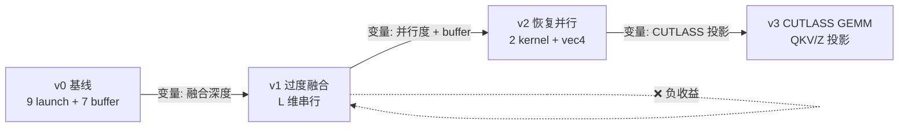

# Fused Conv1D + SiLU CUDA 优化复盘

本文档描述 `fused_conv1d_silu/` 下各版本内核的设计与结论。

说明：本文第 3/4 节为实测数据；NCU basic 部分沿用早前大 launch 口径。

---

## 1. 项目目标

实现一个融合算子，将以下多个操作合并为单个 CUDA kernel，减少内存搬运：

- **Linear(in_proj_qkv)** — 输入投影到 QKV 空间
- **Linear(in_proj_z)**, **Linear(in_proj_a)**, **Linear(in_proj_b)** — 门控投影
- **Causal_Conv1d** — 因果一维卷积（只依赖历史信息）
- **SiLU_Activation** — SiLU 激活函数
- **Split_QKV** — 将结果切分为 Q、K、V

---

## 2. 数学表达式

### 2.1 符号定义

| 符号 | 含义 | 维度 |
|------|------|------|
| `x` | 输入序列 | `(B, L, D)` |
| `W_qkv` | QKV 投影权重 | `(D, 3*H)` |
| `b_qkv` | QKV 投影偏置 | `(3*H)` |
| `W_z, W_a, W_b` | 门控投影权重 | `(D, H)` |
| `b_z, b_a, b_b` | 门控投影偏置 | `(H)` |
| `K_conv` | 因果卷积核 | `(k_size, H)` |
| `Q, K, V` | 输出 QKV | `(B, L, H)` |

### 2.2 前向计算流程

**Step 1: 线性投影**

```
qkv_proj = x @ W_qkv^T + b_qkv          # (B, L, 3*H)

z_proj = x @ W_z^T + b_z                # (B, L, H)
a_proj = x @ W_a^T + b_a                # (B, L, H)
b_proj = x @ W_b^T + b_b                # (B, L, H)
```

**Step 2: Split QKV**

```
Q_raw, K_raw, V_raw = split(qkv_proj, 3, dim=-1)   # each (B, L, H)
```

**Step 3: 门控分支的因果卷积 + SiLU**

```
# Causal Conv1D: 每个位置 t 只依赖 [t-k_size+1, t]
# 对 z_proj 做因果卷积
z_conv[t, h] = sum_{i=0}^{k_size-1} K_{conv}[i, h] * z_proj[t - i, h]
               (其中 t-i < 0 时取 0，即 padding=0)

# SiLU 激活
z_act = SiLU(z_conv) = z_conv * sigmoid(z_conv)

# 对 a_proj, b_proj 同样处理
a_conv = CausalConv1d(a_proj, K_conv)
a_act = SiLU(a_conv)

b_conv = CausalConv1d(b_proj, K_conv)
b_act = SiLU(b_conv)
```

**Step 4: 融合输出**

```
# 典型的 Mamba/SSM 风格融合
V = V_raw * z_act                        # 门控调制 V
Q = Q_raw                                # Q 保持不变
K = K_raw                                # K 保持不变
```

### 2.3 SiLU 激活函数

$$
\text{SiLU}(x) = x \cdot \sigma(x) = x \cdot \frac{1}{1 + e^{-x}}
$$
纯文本：`SiLU(x) = x * sigmoid(x) = x / (1 + exp(-x))`。

### 2.4 Causal Conv1D 的数学定义

对于输入 `u`（形状 `(B,L,H)`），卷积核 `K`（形状 `(k_size,H)`）：

$$
y_{b,t,h} = \sum_{i=0}^{\min(t, k_{size}-1)} K_{i,h} \cdot u_{b, t-i, h}
$$
纯文本：`y[b,t,h] = sum_{i=0..min(t,k_size-1)}(K[i,h] * u[b,t-i,h])`。

其中 `b` 是 batch，`t` 是时间步，`h` 是通道。

---

## 3. 单变量逐步演进

> **方法论：** 每版只改一个瓶颈假设，用 NCU + Roofline 验证后再进入下一版。v1 是**故意走错顺序**的反面教材。

### 3.0 演进总览



| 版本 | **唯一改动点** | 不变量 | 主场景 ms | vs v0 | 判定 |
|:----:|:--------------|:-------|----------:|------:|:-----|
| v0 | —（分解基线） | — | 565.9 | 1.0× | launch + DRAM 往返 |
| v1 | 9 launch → **1 kernel**，L 维串行 | 算法图完整 | 658.3 | **0.86×** ❌ | 并行度崩溃 |
| v2 | **恢复 B×L×H 并行** + 2 kernel + float4 | 仍 1 个 z buffer | 53.4 | **10.6×** | 主要收益 |
| v3 | **CUTLASS SGEMM 投影** | ConvGate 同 v2 | **1.65** | **~343×** | 库级 GEMM |

---

### 3.1 v0：朴素基线（逐个操作分离）

**文件：** `fused_conv1d_silu_v0.cu`

- 每个操作单独实现为 CUDA kernel，中间结果写回全局内存
- 共 5 个 kernel：`LinearKernel`（调用4次）、`SplitQKVKernel`、`CausalConv1dSiLUKernel`（调用3次）、`GateMulKernel`
- 7 个中间张量写回全局内存
- 用于验证正确性和作为后续融合优化的基准
- **瓶颈：** 9 次 kernel launch + 7 个中间张量 DRAM 写回；同一 `x[b,t,:]` 被 4 条 linear 路径重复读取

**改动点：** 无（基线）

**算存判定（NCU）：** Long SB 占比 92%+，Compute **1.7%**，Memory **22%** → **访存/调度主导**，大量时间等 launch 与全局加载。

**B=8, L=2048, D=512, H=256 性能：** 565.9 ms

---

### 3.2 v1：单变量 — 极致融合深度（反面教材）

**文件：** `fused_conv1d_silu_v1.cu`

**本版唯一改动：** 把 v0 的 9 次 launch 合成 **1 个 `FusedKernel`**，中间结果不落 DRAM。

**故意不变（用于隔离变量）：** 线程映射改为 `grid(B, ceil(H/256))`，每个 `(b,h)` 线程 **串行扫 L**——这是 v1 相对 v0 引入的并行模型变化，也是失败根因。

- 使用 **寄存器环形缓冲区** 实现因果卷积滑动窗口
- 消除全部中间全局内存写回

**瓶颈分析：**
- 活跃线程 B×H = **2,048**（v0/v2 为 B×L×H = **4.2M**），occupancy 无法隐藏延迟
- 每线程串行 L=2048 步，Long SB 占比 **99%**
- 寄存器 **168/线程**，编译器 spill

**算存判定：** 表面是 memory-bound（Long SB 99%），根因是 **并行度不足** 导致无法 overlap，而非算法算术强度本身。

**结论：** 融合深度不是越多越好；**先保证并行度，再减 buffer**。

**B=8, L=2048, D=512, H=256 性能：** 658.3 ms（**比 v0 慢 1.16×**）

---

### 3.3 v2：单变量 — 恢复满并行 + 削减中间 buffer

**文件：** `fused_conv1d_silu_v2.cu`

**本版核心改动（相对 v1）：** 把线程映射从 `(b,h)+串行L` 改回 **`(b,t,h)` 全并行**（1D 扁平 grid）。

**附带一并完成（v1 失败后的正确融合路径）：**
- 9 launch → **2 kernel**（`ComputeQKVZ` + `ConvGate`）
- 7 个中间 buffer → **1 个** `z_proj`
- **`float4` 向量化**读 `x` 与权重行

**线程映射：** `grid(ceil(B×L×H/256)) × block(256)`，每线程 1 个 `(b,t,h)`

**算存判定（NCU）：** Memory Throughput **90.6%**，DRAM **0.56%** → 流量主要在 **L1/L2**，Long SB 占比 **58%**；Compute **4.1%** → **访存密集型**（片上缓存命中高）。

**B=8, L=2048, D=512, H=256 性能：** 53.4 ms（**比 v0 快 10.6×，比 v1 快 12.3×**）

---

### 3.4 v3：单变量 — CUTLASS GEMM 投影

**文件：** `fused_conv1d_silu_v3.cu`，`fused_cutlass_gemm.cuh`

**本版唯一改动（相对 v2）：** 用 **CUTLASS `device::Gemm` SGEMM** 替换 Kernel A 的自定义 `ComputeQKVZ` GEMV，将 Q/K/V/Z 四条投影合并为两次矩阵乘。

**不变：** Kernel B 使用 **v2 原版 `ConvGateKernel`**（1D grid，无 SMEM）；2 kernel 融合结构；1 个 `z_proj` buffer。

**GEMM 形状（row-major 语义）：**

| 调用 | 形状 | 说明 |
|------|------|------|
| CUTLASS #1 | `(B·L, D) × (D, 3H) → (B·L, 3H)` | 一次算出 Q/K/V 线性部分 |
| `SplitQKVAddBias` | — | 拆列 + 加 `b_qkv` |
| CUTLASS #2 | `(B·L, D) × (D, H) → (B·L, H)` | z 投影 |
| `AddRowBias` | — | 加 `b_z` |
| `ConvGateKernel` | 同 v2 | 因果卷积 + SiLU 门控 |

- 权重布局与 v0–v2 一致：`W_qkv` 为 `(3H, D)` 行主序；`fused_cutlass_gemm.cuh` 封装 RowMajor × ColMajor，`W` 按 `(N,K)` 存储等价于 `X @ W^T`
- `GemmWorkspace` 按需分配 CUTLASS workspace（`can_implement` + `initialize`）
- **构建依赖：** 系统 CUTLASS（默认 `$HOME/cutlass`），CMake 可通过 `-DCUTLASS_DIR=...` 覆盖；需 `--expt-relaxed-constexpr`、C++17

**性能分析：**

| 规模 | v2 ms | v3 ms | vs v2 | 解读 |
|------|------:|------:|------:|------|
| B=1,L=128,D=64,H=32 | 0.016 | 0.059 | 0.27× | CUTLASS launch + workspace 固定开销 |
| B=1,L=256,D=128,H=64 | 0.033 | 0.084 | 0.39× | 同上 |
| B=2,L=512,D=256,H=128 | 0.428 | **0.065** | **6.6×** | GEMM 规模足够 |
| B=8,L=2048,D=512,H=256 | 53.4 | **1.65** | **~32×** | 投影瓶颈被 GEMM 消除 |

主场景投影算量 ≈ **17 GFLOP**，v3 **1.65 ms** → 有效 **~10 TFLOPS**；相对 v2 手写 GEMV 是数量级跃迁。

**NCU 画像：** 主场景单次迭代中 **QKV CUTLASS GEMM 占 ~57%**（960 µs，Compute **73%**）；`SplitQKVAddBias` DRAM **89%**（Long SB **75**）为 GEMM 后 scatter 瓶颈。详见 §8.3。

**B=8, L=2048, D=512, H=256 性能：** 1.65 ms（**比 v0 快 ~343×，比 v2 快 ~32×**）。

---

## 4. 性能对比

实测日期：**2026-05-20**（本机复跑）

测试环境：**RTX 5060 Ti（sm_120, 16GB），CUDA 13.2**。

| 版本 | B=8,L=2048 ms | 加速比(v0) | 单变量改动 | 中间缓冲 |
|:----|:--------:|:----------:|:----------|:---------:|
| v0 | 565.9 | 1.0× | 基线 | 7 |
| v1 | 658.3 | **0.86×** ❌ | 极致融合 / L 串行 | 0 |
| v2 | 53.4 | **10.6×** | 恢复并行 + 2 kernel | 1 |
| v3 | **1.65** | **~343×** | CUTLASS SGEMM 投影 | 2* |

\* v3 投影阶段临时使用 `qkv` buffer（`(B·L, 3H)`），ConvGate 仍复用 `z_proj`。

### 完整规模对比（耗时 ms）

| 规模 | v0 | v1 | v2 | v3 |
|------|:--:|:--:|:--:|:--:|
| B=1, L=128, D=64, H=32 | 0.819 | 0.845 | **0.016** | 0.059 |
| B=1, L=256, D=128, H=64 | 3.873 | 3.898 | **0.033** | 0.084 |
| B=2, L=512, D=256, H=128 | 26.75 | 29.27 | 0.428 | **0.065** |
| B=4, L=1024, D=512, H=256 | 250.4 | 331.2 | 13.27 | **0.363** |
| B=8, L=2048, D=512, H=256 | 565.9 | 658.3 | 53.4 | **1.65** |

### 各规模加速比（vs v0）

| 规模 | v1 | v2 | v3 |
|------|:--:|:--:|:--:|
| B=1, L=128 | 0.97× | **51×** | 14× |
| B=1, L=256 | 0.99× | **117×** | 46× |
| B=2, L=512 | 0.91× | 62× | **411×** |
| B=4, L=1024 | 0.76× | 19× | **690×** |
| B=8, L=2048 | 0.86× | 10.6× | **343×** |

> v3 在大规模上靠 GEMM 取得数量级提升；小矩阵受库 launch 开销限制（B=1,L=128 慢于 v2）。主场景用 **B=8,L=2048**。

---

## 5. Roofline 与算存判定

### 5.1 算术强度估算（主场景 B=8,L=2048,D=512,H=256,k=4）

每个输出元素 `(b,t,h)` 的核心计算（v2 手写 GEMV 路径）：

| 操作 | FLOPs | 最小字节搬运 |
|------|------:|-------------:|
| 4× GEMV（q/k/v/z，长度 D） | 4 × 2D = **4096** | 读 x[D] + 4 行权重[4D] + 写 4 float |
| Causal Conv + SiLU + gate | ~**20** | 读 z[k] + 写 V |
| **合计** | **~4116 FLOP/elem** | **~5D×4 ≈ 10 KB/elem**（无复用下界） |

全量：N = B×L×H = **4.19M** 元素

- 总计算量 ≈ **17.2 GFLOP**
- 总搬运量（理想下界，x 每 token 只读 1 次）≈ **35 GB**（权重行重复读占主导）

**算术强度 AI ≈ 17.2 GFLOP / 35 GB ≈ 0.5 FLOP/Byte**（量级与 RMSNorm 相当）

RTX 5060 Ti Ridge Point ≈ **52.5 FLOP/Byte**（448 GB/s ÷ 23.5 TFLOPS FP32）

```
AI ≈ 0.5  <<  Ridge Point 52.5  →  Roofline 判定：访存受限
```

实测主场景 v2：**53.4 ms** → 有效带宽 ≈ 35 GB / 0.0534 s ≈ **655 GB/s**（> 448 GB/s 峰值）→ 说明 **权重矩阵大量命中 L2**，不是纯 DRAM 饱和，但仍是 memory-bound 访问模式。v3 改走 GEMM 后该估算不再适用。

### 5.2 各版本算存画像（NCU + Roofline 综合）

| 版本 | Compute(SM) | DRAM | Memory | 主导 Stall | Roofline 判定 | 优化方向 |
|:----:|------------:|-----:|-------:|:-----------|:----------------|:---------|
| v0 | 1.7% | 0.7% | 22% | Long SB 92% | 访存 + **launch 开销** | 减 buffer / 融合 |
| v1 | 1.7% | 0.9% | 21% | Long SB 99% | **并行度不足**（非算存比问题） | 恢复并行 |
| v2 | 4.1% | 0.6% | **91%** | Long SB 58% | **访存受限**（片上流量） | 换 GEMM |
| v3 | **67%**† | **52%**† | **52%**† | MIO Thr / Long SB‡ | **投影转计算饱和** | 融合 SplitQKV / FP16 TC |

† 主场景 `B=8,L=2048` 下 **QKV CUTLASS GEMM**（`grid=768`，Duration **960 µs**）单次 launch 快照。  
‡ 同一主场景单次 `RunFusedV3` 五 kernel 按 Duration 加权：Long SB **~10.3**，MIO Thr **~0.7**；`SplitQKVAddBias` 单 kernel Long SB **74.9**。

**与 GEMM/RMSNorm 对照：**
- GEMM 4096³：AI ≈ 683，Compute 饱和 → 计算密集
- RMSNorm：AI ≈ 0.5，DRAM 饱和 → 访存密集
- **v2 投影路径：AI ≈ 0.5，Memory 91%，Compute 4%** → 访存密集型（与 RMSNorm 同类）
- **v3 投影路径：CUTLASS SIMT GEMM Compute 67–73%，DRAM 46–52%** → **计算主导**（瓶颈类别与 v2 根本不同）

### 5.3 是否优化到位？

| 判据 | 目标 | v3 现状 | 结论 |
|------|------|---------|------|
| vs v0 端到端 | 融合消除冗余 DRAM | **~343×** | ✅ 投影 + 融合双收益 |
| vs v2 边际 | GEMM 替换 GEMV | **~32×**（主场景） | ✅ 根本解决权重复用 |
| 小矩阵 | 不能灾难性退化 | B=1,L=128 慢于 v2 | ⚠️ 库有 launch 下限 |
| 剩余瓶颈 | — | **QKV CUTLASS GEMM ~57%**；`SplitQKV` DRAM 89% | 融合 bias/split 或 FP16 TC |

**总结：手写 GEMV 路径在大 D 上已触及天花板**；v3 用 `(B·L,D)×(D,3H)` CUTLASS GEMM 将主场景从 **53 ms → ~1.7 ms**。NCU 显示瓶颈从 v2 的 **访存型 GEMV** 转为 **CUTLASS SIMT GEMM 计算饱和 + SplitQKV 内存 scatter**。v1 仍证明：**牺牲并行度的融合必败**。

---

## 6. 关键经验

### 6.1 融合算子的核心矛盾

**融合深度 vs 并行度** 是融合算子最根本的权衡：

- **v1 的教训**：把所有步骤塞进一个 kernel 并将 L 维串行化，虽然消除了所有中间缓冲，但并行度剧降（2,048 vs 4.2M 线程），得不偿失
- **v2 的突破**：将 5 个 kernel 精简为 2 个，在保留满并行度的前提下消除 6/7 的中间缓冲
- **v3 的跃迁**：投影阶段从逐元素 GEMV 转为 CUTLASS batched GEMM

### 6.2 每一个 GPU 融合算子的设计都应该回答的问题

算子融合的核心判断标准：
1. **中间张量规模与 DRAM 带宽的比值**（决定融合带来的访存节省）
2. **融合后 kernel 的并行度与原始分离方案的对比**（决定是否会引入新的瓶颈）
3. **融合后 kernel 的寄存器压力与共享内存占用**（决定实际可达的占用率）

### 6.3 优化策略的有效性排名

对本项目的各优化手段进行排列：

1. **GEMM 投影**（v3 vs v2 主场景）：**~32×** — 大 D 下决定性一步
2. **恢复满并行度**（v2 vs v1）：**~10×** — 最关键，决定 GPU 能否调度
3. **消除中间 buffer**（v2 vs v0）：**~10×** — 减少 DRAM 往返
4. **float4 向量化**（v2 内含）：**~20–30%** — 提高带宽利用率

### 6.4 当前环境口径（RTX 5060 Ti）

本目录中的性能结论统一以本地环境为准：`RTX 5060 Ti (sm_120, Blackwell) + CUDA 13.2`。  
若后续更换硬件平台，请重新运行本目录的 benchmark 并覆盖对应数据表。

---

## 7. 产物路径

- **可执行文件：** `build/bin/fused_conv1d_silu_v0` … `fused_conv1d_silu_v3`
- **v3 依赖：** CUTLASS（`CUTLASS_DIR`，默认 `$HOME/cutlass`）
- **结果 CSV：** `data/results/fused_conv1d_silu_v0_results.csv` … `v3_results.csv`
- **NCU 报告（v3 主场景）：** `data/ncu_reports/v3_20260519/`
- **CUDA 架构：** RTX 5060 Ti，Compute Capability **sm_120**，CUDA 13.2

## 8. Nsight Compute 瓶颈分析

> **口径：** v0–v2 basic 沿用早前大 launch 快照；v3 为复测数据（RTX 5060 Ti sm_120）。

### 8.1 采集命令

**全量 per-kernel 汇总（含各 benchmark 规模）：**

```bash
ncu --set basic --target-processes all --kernel-name-base demangled \
    --print-summary per-kernel ./build/bin/fused_conv1d_silu_v3
```

**主场景 `B=8,L=2048,D=512,H=256` 单次 `RunFusedV3` 五 kernel（跳过前 4 个 test case 的 220 次 launch）：**

```bash
ncu --set basic --target-processes all --kernel-name-base demangled \
    --print-summary per-kernel --launch-skip 225 --launch-count 5 \
    ./build/bin/fused_conv1d_silu_v3
```

**Stall 指标（同上主场景口径）：**

```bash
ncu --target-processes all --kernel-name-base demangled \
    --print-summary per-kernel --launch-skip 225 --launch-count 5 \
    --metrics smsp__average_warps_issue_stalled_long_scoreboard_per_issue_active.ratio,\
smsp__average_warps_issue_stalled_short_scoreboard_per_issue_active.ratio,\
smsp__average_warps_issue_stalled_wait_per_issue_active.ratio,\
smsp__average_warps_issue_stalled_mio_throttle_per_issue_active.ratio,\
smsp__average_warps_issue_stalled_math_pipe_throttle_per_issue_active.ratio \
    ./build/bin/fused_conv1d_silu_v3
```

### 8.2 跨版本对比（basic set）

统计口径：v0–v2 取 Duration **最大**的一次 launch；v3 取主场景 **QKV GEMM**（Duration 最大子 kernel）。

| 版本 | 代表内核 | Max Duration(µs) | Compute(SM) | DRAM | Memory | Achieved Occupancy | Reg/Thr | 结论 |
|:-----|:---------|-----------------:|------------:|-----:|-------:|-------------------:|--------:|:-----|
| `v0` | `FusedSingleKernel` | 485.70 | 1.70% | 0.68% | 21.87% | 16.14% | 44 | 利用率低，分离路径开销明显 |
| `v1` | `FusedKernel` | 510.85 | 1.67% | 0.92% | 21.43% | 16.55% | 168 | 融合后寄存器压力过高，仍低利用 |
| `v2` | `ComputeQKVZKernel` | 698.75 | 4.13% | 0.56% | 90.63% | 62.08% | 56 | 访存系统高度活跃，片上/缓存流量主导 |
| `v3` | CUTLASS `Gemm`（QKV，grid 768） | **960.5** | **73.3%** | **51.6%** | **51.7%** | **32.7%** | **121** | SIMT GEMM 计算饱和；寄存器/SMEM 限制 occupancy |

说明：v2 的 `Memory Throughput` 高而 `DRAM Throughput` 低，表示大量流量命中 L1/L2。v3 投影走 CUTLASS **SIMT** 路径（非 Tensor Core），Compute 与 DRAM 同时偏高，属于 **batched GEMM 计算饱和** 而非 v2 式访存主导。

### 8.3 v3 主场景 kernel 分解（`B=8,L=2048`，单次迭代）

| 阶段 | Kernel | Grid | Duration(µs) | 占比 | Compute | DRAM | Occupancy | Reg | 判定 |
|------|--------|-----:|-------------:|-----:|--------:|-----:|----------:|----:|:-----|
| 投影 #1 | CUTLASS GEMM `(BL,D)×(D,3H)` | 768 | **960.5** | **56.7%** | 73.3% | 51.6% | 32.7% | 121 | **主耗时**；MIO Thr 0.60 |
| 后处理 | `SplitQKVAddBias` | 16384 | 202.6 | 12.0% | 14.1% | **89.4%** | 85.1% | 26 | **DRAM 带宽型**；Long SB **74.9** |
| 投影 #2 | CUTLASS GEMM `(BL,D)×(D,H)` | 256 | 348.4 | 20.6% | 67.3% | 45.6% | 31.6% | 121 | 同 QKV GEMM 画像 |
| 后处理 | `AddRowBias` | 16384 | 54.8 | 3.2% | 31.4% | 80.1% | 76.8% | 16 | 轻量带宽 kernel |
| Kernel B | `ConvGateKernel` | 16384 | 127.4 | 7.5% | 62.5% | 66.0% | 73.4% | 46 | 计算+访存混合；Long SB 7.0 |
| **合计** | — | — | **~1693** | 100% | — | — | — | — | 与 benchmark **~1.65 ms** 一致 |

**有效吞吐（主场景）：**
- 投影总算量 ≈ **17.2 GFLOP** → 端到端 **~10.3 TFLOPS**
- 仅 QKV GEMM：**~13.4 TFLOPS**（12.9 GFLOP / 0.96 ms）

**关键结论：**
1. **v2 → v3 的本质变化**：瓶颈从「4×逐元素 GEMV 重复读权重」（Memory 91%）变为「2×CUTLASS batched GEMM」（Compute 67–73%）。
2. **新暴露瓶颈**：`SplitQKVAddBias` 将 `(BL,3H)` 拆成 Q/K/V 时 **DRAM 89%**、Long SB **74.9**——属于 GEMM 后的 **内存 scatter**，占端到端 **~12%** 时间。
3. **CUTLASS 选型**：默认 `device::Gemm<float,...>` 在 sm_120 上选中 **SIMT 128×128×8 pipeline**（121 reg/thread，17 KB dynamic SMEM），occupancy **~33%**；未走 Tensor Core。
4. **ConvGate 并非主瓶颈**（~7.5%）；进一步优化应优先 **QKV GEMM（FP16/TC）** 或 **融合 SplitQKV+bias**。

---

## Warp Stall 原因分析

> **口径：** v0/v2 为全量 NCU 第一次 launch；v3 为主场景单次 `RunFusedV3` 五 kernel 按 Duration 加权平均。

| 版本 | Long SB | Short SB | Wait | MIO Thr | Math Pipe | 总 Stall |
|:----|--------:|---------:|-----:|--------:|----------:|---------:|
| v0 | **5.49** | 1.75 | 2.49 | 0.08 | 0.07 | 12.99 |
| v2 | **31.56** | 0.24 | 1.23 | 0.00 | 0.09 | 33.73 |
| v3 | **10.33** | 1.18 | 0.79 | 0.67 | 0.06 | **13.03** |

v3 分 kernel stall（主场景，未加权）：

| Kernel | Long SB | MIO Thr | Math Pipe | 解读 |
|--------|--------:|--------:|----------:|:-----|
| CUTLASS GEMM（QKV / Z） | **0.11** | **0.54–0.60** | 0.08 | 计算饱和，等 MIO 供数 |
| `SplitQKVAddBias` | **74.94** | 0.20 | 0.16 | 等全局内存（scatter 读 qkv、写 Q/K/V） |
| `ConvGateKernel` | 7.00 | 0.06 | 0.39 | 访存+算术混合 |

v0 Long SB 占比 92%+；v2 融合 + float4 后 Long SB **31.6**（访存主导）。v3 端到端 Long SB 降至 **~10.3**，但 **并非 uniform**——CUTLASS GEMM 几乎无 Long SB，scatter 后处理重新引入 DRAM stall。

## 9. PTX / SASS

PTX 和 SASS 可在本地通过 `cuobjdump -ptx <binary>` 或 `cuobjdump -sass <binary>` 生成（`**/asm/` 已从版本控制中排除）：

---

## 主场景性能口径（统一）

实测日期：**2026-05-20**

| 实现 | 主场景维度 | GPU耗时(ms) | vs v0 | 校验状态 |
|---|---|---:|---:|---|
| `fused_conv1d_silu_v0` | `B=8,L=2048,D=512,H=256,k=4` | 565.9 | 1.0× | PASS |
| `fused_conv1d_silu_v2` | `B=8,L=2048,D=512,H=256,k=4` | 53.4 | 10.6× | PASS |
| `fused_conv1d_silu_v3` | `B=8,L=2048,D=512,H=256,k=4` | **1.65** | **~343×** | PASS |

环境口径：`RTX 5060 Ti (sm_120) + CUDA 13.2`。
